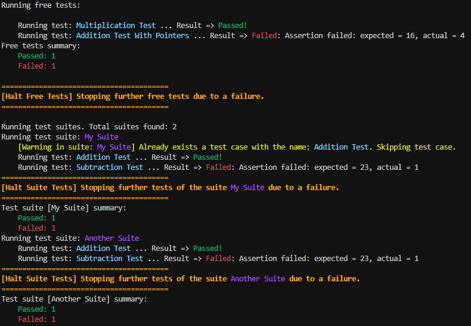
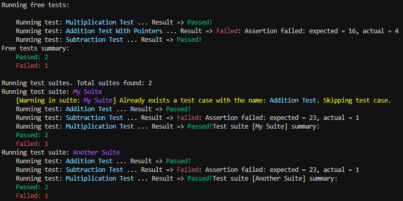

#  *Zero's project* **Test Suite**

## **Introduction**

Welcome to the Zero's project custom test-suite! This test-suite is a lightweight and efficient tool designed to help developers confidently develop their C++ code. With the goal of ensuring code quality and correctness, the test-suite provides a simple yet powerful way to write and run test cases.

This custom test-suite emphasizes flexibility and simplicity, allowing developers to write tests using modern C++ features
like modules and concepts. It aims to minimize external dependencies and provide a seamless testing experience that integrates
well with C++ projects.

By using this test-suite, developers can quickly validate their code changes, identify potential issues, and maintain a robust and reliable codebase.
Whether you are a seasoned C++ developer or just starting your coding journey, the custom test-suite can be a valuable addition to your development toolkit.

### *Disclaimer*

As all the code in `**Zero**`, is a cutting-edge latest C++ standard features, latest standard version
and latest standard library features codebase. Also, the suite doesn't contains yet a lot of `assertions`
features, since they will be developed based on our needs. But it would be fine to have a nice collection of
them, so feel free to open a *PR* and help us!

## **History**

The `tsuite` module born out of the need of having a minimalistic implementation of a test-suite 
that mainly allows ourselves to develop our source code with confidence, without depending on some
third-party changing standard implementations while avoiding typical dependency pitfalls.

We used for a long time the `Catch2` test suite, but, since the release of `Clang 16` our usage of
`C++23` and modules made `Clang` go crazy when trying to compile `Catch 2`, so we lost our ability to
develop this codebase based on *TDD*, and lost basically our testing workflow.

Other alternatives that we've tried does not fit particularly well with our workflow. And, since we try
to use the latest standard releases, with the latest **std** library features implemented in our used
compilers, we've always ended losing more time trying to understand what's not ready yet in the compilers,
or how what we should be doing to make it work. 

Even tho, we doesn't mean that there's no good C++ test suites out there. In fact, there's a couple of
good really ones, with years of experience, like `Catch2` and `GTest`. But, since we also do not use any of
the mainstream build systems (we're using **Zork++**), those suites are highly integrated with them, but not
ready to use out-of-the-box within our development environment, so finally, we decided that we could spend
some time writing a whole new suite that better fits our environment's needs, that is ready to work with modules
without any complication, and that will be growing up and scaling based on user's feedback and our own needs.

## **Test Suite Structure**
The custom test-suite consists of two modules: the `tsuite` primary interface module and `tsuite:assertions` module partition.
The `tsuite` module handles test suite registration, test case registration, and test execution.
On the other hand, the `tsuite:assertions` partition contains various assertion functions used within the test cases.

Notice that `tsuite:assertions` is a partition module interface related with `tsuite`. You only need to
`import tsuite` to be able to work with all the features available within the suite, as they are all
re-exported through the primary module interface `tsuite`. 

With this organized structure, developers can easily register test cases and suites, run tests, and obtain meaningful feedback on the results. The suite provides a clear separation of concerns, enabling smooth collaboration between different team members and enhancing code maintainability.

##  **Standalone Tests or Test Suites**

#### - **Standalone Tests**:
Standalone tests are individual test cases that are registered directly in the test suite using the `TEST_CASE(...)` function.
These tests can be defined as standalone functions or lambdas and are registered with a unique name that identifies the test case.
Standalone tests are suitable for small, isolated test scenarios that don't need to be grouped together.

#### - **Test Suites**:
Test suites are groups of related test cases that are logically organized together.
Each test suite has a unique identifier called uuid, and it contains multiple test cases.
Test cases within a suite can be registered using the `TEST_CASE(...)` function,
just like standalone tests, but choosing the overload that receives as its first parameter
a reference to the test suite.

### **Test Modes**
In the pursuit of flexibility and control over the test execution process, our testing framework offers different modes of operation. These modes determine the test runner's behavior in response to test failures, allowing users to tailor the testing process according to their specific needs or the nature of the tests being run.

1. **CONTINUE_ON_ERROR**
   - **Description**: This mode ensures that all tests are executed regardless of any failures encountered. It's ideal for comprehensive error analysis or understanding the full extent of issues in the codebase.
   - **Use Case**: Opt for this mode when a complete analysis of the system's state is required, particularly to identify all potential problems in a single test run.

2. **HALT_SUITE_ON_FAIL**
   - **Description**: In this mode, the test suite halts the execution of the current suite or free tests upon encountering a failure, then proceeds to the next suite or free test. It allows for a quick bypass of problematic tests while still performing remaining tests.
   - **Use Case**: Useful for scenarios where quickly identifying and addressing failures is important, without getting bogged down by tests in a problematic suite.

3. **ABORT_ALL_ON_FAIL (Default mode)**
   - **Description**: This mode adopts a zero-tolerance approach towards test failures. As soon as any test fails, it immediately halts all further testing activities.
   - **Use Case**: Use this mode to avoid wasting time on further tests when there's already a known issue that needs fixing.
   
## **Example of usage**

Here's an example of how to use the custom test-suite to write and run test cases:

```c++
// Import the necessary modules
import std;  // Should be ready on all the major compilers for C++23. But until this date, any
// one of them made the std lib implementation as a module as the standard mandates, so we are working
// with the `Zork++` out of the box solution based on Clang modulemaps.
import tsuite;

// Let's define some example test functions using the assertion function
void testAddition() {
    int result = 2 + 2;
    assertEquals(4, result);
    assertEquals(4, result);
    assertEquals(4, result);
}

// Let's define some more example test functions using the assertion function
void testSubtraction() {
    int result = 3 - 2;
    assertEquals(1, result);
    assertEquals(23, result);
    assertEquals(1, result);
}


// Let's define even more example test functions using the assertion function
void testMultiplication() {
    int result = 2 * 2;
    assertEquals(4, result);
    assertEquals(4, result);
    assertEquals(4, result);
}


// Passing two pointers to compare if the values that they point to are equals
void testPtrsAddition() {
    int result = 2 + 2;
    int expected = 4;
    int wrongExpected = 16;
    assertEquals(&expected, &result);
    assertEquals(&wrongExpected, &result);
}

// Driver code
int main() {

    TEST_CASE("Multiplication Test", []() {
        int result = 5 * 3;
        assertEquals(15, result);
        assertEquals(15, result);
    });


    // Register a new test case using a function pointer.
    TEST_CASE("Addition Test With Pointers", testPtrsAddition);

    // Users can register a new test case using lambdas, avoiding writing standalone functions
    TEST_CASE("Subtraction Test", []() {
        int result = 5 - 3;
        assertEquals(2, result);
        assertEquals(2, result);
    });

    // Registering test cases into test suites, to group and relate tests that makes sense to exists
    // as a part of a whole

    // Instantiate a new test suite, giving it a unique identifier.
    TestSuite suite {"My Suite"};
    // Register test cases using function pointers into a test suite
    TEST_CASE(suite, "Addition Test", testAddition);
    // Forces a warning that alerts the user that the test will be discarded, since already
    // exists one with the same identifier in the given suite
    TEST_CASE(suite, "Addition Test", testAddition);
    // Register a test case designed to fail, useful for testing the behavior 
    // of RUN_TESTS with different failure modes.
    TEST_CASE(suite, "Subtraction Test", testSubtraction);

    // Register additional test cases to verify the functionality of RUN_TESTS
    // under different conditions.
    TEST_CASE(suite, "Multiplication Test", testMultiplication);

    // Create another test suite to further validate the behavior of RUN_TESTS
    // with multiple suites, especially under different failure modes.
    TestSuite anotherSuite {"Another Suite"};
    TEST_CASE(anotherSuite, "Addition Test", testAddition);
    TEST_CASE(anotherSuite, "Subtraction Test", testSubtraction);
    TEST_CASE(anotherSuite, "Multiplication Test", testMultiplication);

    // Don't forget to call this free function, to run all the tests written!
    // Options are: CONTINUE_ON_ERROR, HALT_SUITE_ON_FAIL, ABORT_ALL_ON_FAIL (default)
    RUN_TESTS();

    return 0;
}
```

With these examples, you will see different results depending on the mode used:

1. **ABORT_ALL_ON_FAIL** mode (Default):
   

2. **HALT_SUITE_ON_FAIL** mode:
   

3. **CONTINUE_ON_ERROR** mode:
   

## Funny facts

As you see in the examples, we mostly use upper snake case convention for the standalone functions
that takes care of register tests or run all the test written. But... they are not macros!
They are just regular standalone functions available within the `zero` namespace.

One of the worst part of the `C++` test suites is that almost every one are macro-based.
But, for having a kind of environmental integration, and as a kind of tribute as well,
as we've maintained the name of these free functions with the same conventions used for
most of them.
